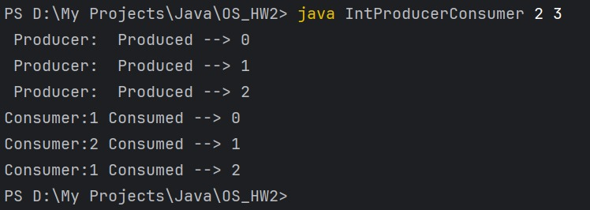
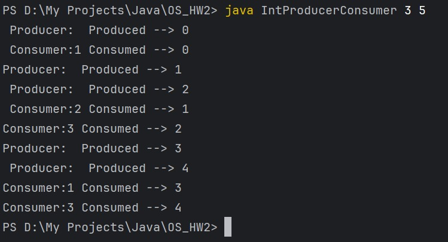
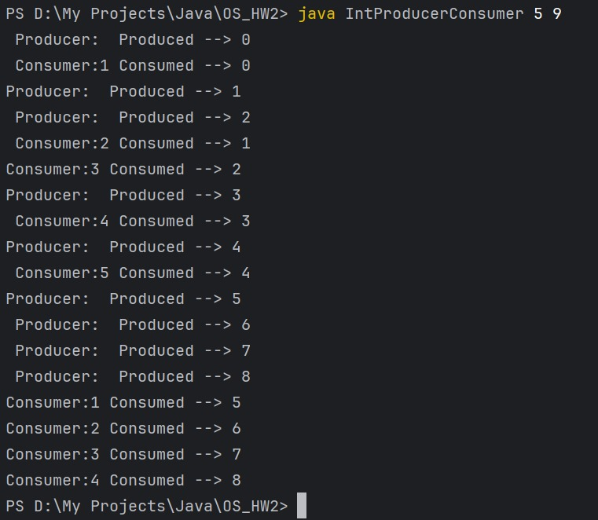
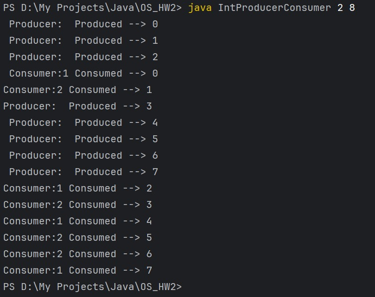

# ProducerConsumer_OS_Assignment - COEN 283 HomeWork 2

## Name: Pavan Kumar Srinivasulu <br> Student ID: 07700005991 <br> Email: psrinivasulu@scu.edu

## Question
Write a Producer-Consumer multi-threaded Java program.

Introduction
One thread, the producer, will generate a sequence of integers and write them in order to successive buffer cells. Several consumer threads will then read these integers from the buffer and print them out in the order read. The is a circular buffer shared between the producer and consumers.

Tasks
Create a single producer thread that produces a stream of integers and writes them into a circular buffer, and several consumer threads that read the integers from the buffer and print them to the console.

The producer thread should produce integers until the buffer is full; then, it will wait until the consumers remove some entries from the buffer. The producer should continue to create integers until it reaches a maximum specified on the command line, then it should exit.

The consumer threads should consume integers from the buffer until it is empty, then wait for the producer to put more integers into the buffer. The consumers should continue to remove integers from the buffer until they have removed and printed all of them; then, they should exit.

Note that this requires several shared variables and data structures: the buffer, input and output locations, and counts of integers produced and consumed.

2.1 Thread Entry Points

Each thread must have a function that represents the entry point into the thread's flow of control.

You must therefore implement several functions to serve as thread entry points:

int producer() Generates a sequence of integers starting at 0, and writes them to successive buffer locations.
int consumer() Reads the next entry from the buffer and writes the integer contained therein to the console.
2.2 Circular Buffer Abstraction

Use Blocking Operations: You use condition variables to make a function blocking. The thread library provides a function that blocks until the specified condition variable is true. Thus any function that includes a call to that function becomes a blocking operation.

Note that you need to protect the critical section of each of the operations. So use a mutex or binary semaphore with lock() implementing the semaphore wait operation, and unlock() implementing the signal operation.

2.3 Creating threads

Once you have implemented your producer and consumer functions, you have to create producer and consumer threads in your program. Do this in main(). Note: your program should take one argument: the number of consumer threads to create.

## Solution

The <b>IntProducerConsumer</b> Java program is designed to fulfill the specified requirements asked above the question. It operates with a Producer thread responsible for generating integers based on the buffer size and the maximum value provided via the command line. Subsequently, Consumer threads consume these integers once they've been produced, continuing consumption until the buffer is empty. 

### Command to compile the java program.
```bash
javac IntProducerConsumer.java
```
### Command to run the java program.

```bash
java IntProducerConsumer <numOfConsumers> <totalValues> 
```

## Results

<b>In what order were the integers printed?</b><br>
The integers are printed in the same order as the producers produced the integers, then several consumer consmes it.<br>

Refer the below screenshots for the actual output flow. 

Output 1:

 <br>

Output 2:

 <br>

Output 3:

 <br>

Output 4:

 <br>

Watch the demo here
)

## Discussion

<b>(1) How many of each integer should you see printed?</b><br>
Each integer should be printed only once, given that the producer generates a sequence starting from 0 up to the total specified values. Since the consumers should consume all the integers produced without duplicates, the expected count for each integer should be 1.

<b>(2) In what order should you expect to see them printed? Why?</b><br>
The integers should be printed in ascending order, starting from 0 and incrementing by one until the maximum value specified on the command line is reached. This order is expected due to the producer generating the integers sequentially and the circular buffer maintaining their order of insertion.

<b>(3) Did your results differ from your answers in (1) and (2)? Why or why not?</b><br>
My result perfectly aligns with the expectations in (1) and (2). Each integer is been printed only once, in ascending order, mirroring the sequence generated by the producer thread. If the consumer threads consume all integers as expected without duplicates, the output should match the anticipated order and count for each integer.<br>
Adjustments or discrepancies might occur if there are issues in the code logic, such as incorrect buffer handling, synchronization problems, or incorrect thread behavior, leading to missing or duplicate integers in the output.<br>
Since my code aims for correct buffer handling, synchronization, and utilizes blocking operations effectively, we should not face any discrepancies.
